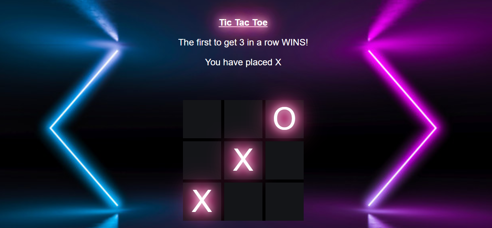

# TicTacToe

This is my take on the age old game, tic tac toe. Click a box, either "X" or "O" will pop up and keep going until you have 3 in a row.

**Link to project:** https://kr-tictactoe.netlify.app/

## How It's Made:
**Tech used:** HTML, CSS, JavaScript

I used JavaScript to make the tic tac toe functional. I used this project to focus on implementing Object Oriented Programming. I wanted to give the tic tac toe a nice visual pop, so I added glow in the dark to the CSS!

## Lessons Learned:

I learned how to implement classes more in my JavaScript. Using OOP and creating objects truly helped me keep my code more neat and condensed.
